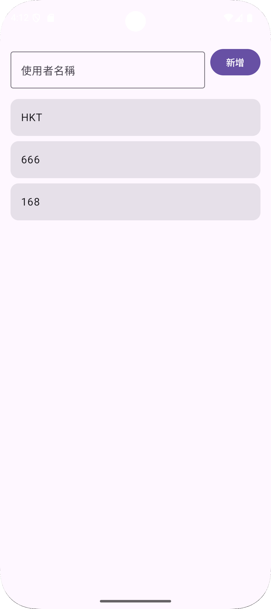
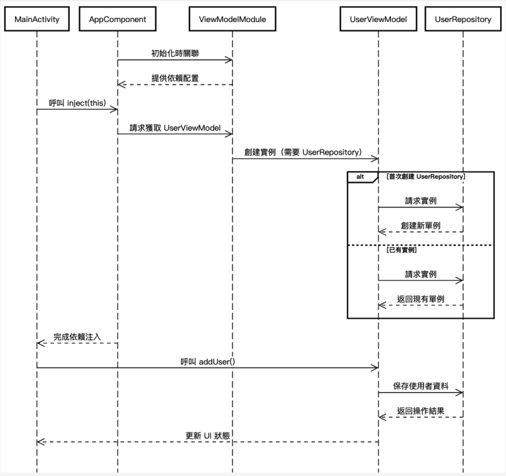

# Android Dagger 入門範例

本範例學習如何在 Android 開發中使用 Dagger 依賴注入技術。

這是一個基於 Dagger 2 的 Android 範例專案，展示了如何利用 Dagger 2 進行依賴注入管理。專案採用現代 Android 開發技術，並提供實際應用中的最佳實踐，幫助開發者輕鬆實現依賴注入。

## UI 畫面


## 技術特點

### 1. 依賴注入 (Dependency Injection)
- 使用 Dagger 2.55 進行依賴注入
- 實現 `@Singleton` 單例模式
- 使用 `@Inject` 構造函數注入
- 使用 `@Component` 和 `@Module` 管理依賴關係

### 2. 架構模式
- 採用 MVVM (Model-View-ViewModel) 架構
- 使用 Repository 模式管理數據
- 清晰的關注點分離

### 3. UI 技術
- 使用 Jetpack Compose 構建現代化 UI
- Material Design 3 設計規範
- 響應式 UI 更新
- 安全區域調整

## 專案結構

```
com.hkt.daggerdemo/
├── data/
│   └── UserRepository.kt        # 數據層：管理用戶數據
├── di/
│   ├── AppComponent.kt         # Dagger 組件：定義注入點
│   └── ViewModelModule.kt      # Dagger 模組：提供 ViewModel
├── ui/
│   └── UserViewModel.kt        # 視圖模型：處理業務邏輯
└── MainActivity.kt             # UI 層：用戶界面
```

## 核心功能

1. **用戶管理**
   - 新增用戶
   - 顯示用戶列表
   - 即時 UI 更新

2. **錯誤處理**
   - 完整的異常捕獲
   - 詳細的日誌記錄
   - 用戶輸入驗證

## 關鍵實現細節

### 1. 依賴注入設置
```kotlin
@Singleton
@Component(modules = [ViewModelModule::class])
interface AppComponent {
    fun inject(activity: MainActivity)
}
```

### 2. ViewModel 注入
```kotlin
class UserViewModel @Inject constructor(
    private val userRepository: UserRepository
) : ViewModel()
```

### 3. Repository 實現
```kotlin
@Singleton
class UserRepository @Inject constructor() {
    private val users = mutableListOf<String>()
    // ...
}
```

## 日誌記錄

專案實現了完整的日誌系統，包含以下幾個層面：

1. **Activity 層**
   - 依賴注入狀態
   - 用戶操作記錄
   - 異常捕獲

2. **ViewModel 層**
   - 業務邏輯執行
   - 數據操作追蹤

3. **Repository 層**
   - 數據存取記錄
   - 狀態變更追蹤

## 最佳實踐

1. **依賴注入**
   - 使用 `@Singleton` 確保單例
   - 通過 `@Inject` 實現構造函數注入
   - 使用 Module 管理複雜依賴

2. **UI 設計**
   - 使用 `safeDrawingPadding()` 確保內容不被系統 UI 遮擋
   - 實現單行輸入限制
   - 即時響應數據變化

3. **錯誤處理**
   - 使用 try-catch 捕獲異常
   - 分級日誌記錄
   - 用戶友好的錯誤提示

## 開發環境要求

- Android Studio Hedgehog 或更高版本
- Kotlin 1.9.0 或更高版本
- Minimum SDK: 24
- Target SDK: 35
- JDK 11

## 依賴項

```kotlin
// Dagger
implementation("com.google.dagger:dagger:2.55")
kapt("com.google.dagger:dagger-compiler:2.55")

// Jetpack Compose
implementation(platform("androidx.compose:compose-bom:2025.01.00"))
implementation("androidx.compose.material3:material3")
```

## 如何使用

1. Clone 專案
2. 在 Android Studio 中打開專案
3. 等待 Gradle 同步完成
4. 運行應用程式

## 學習要點

1. **Dagger 基礎**
   - 理解 `@Inject`、`@Component`、`@Module` 的使用
   - 掌握依賴注入的基本原理

2. **MVVM 架構**
   - ViewModel 與 UI 的交互
   - Repository 模式的應用

3. **Jetpack Compose**
   - 聲明式 UI 的構建
   - 狀態管理和更新

## 時序圖



### 時序流程說明

#### 1. 應用程式初始化階段
- **AppComponent**（核心元件）在應用啟動時進行初始化。
- **AppComponent** 主動連結 **ViewModelModule**（視圖模型模組），配置後續依賴關係。
- **ViewModelModule** 回傳依賴配置資訊至 **AppComponent**，完成基礎設定。

#### 2. Activity 創建階段
- **MainActivity**（主畫面）創建時，向 **AppComponent** 發起 `inject(this)` 請求，觸發依賴注入流程。
- **AppComponent** 向 **ViewModelModule** 請求獲取 **UserViewModel**（使用者資料的視圖模型）。
- **ViewModelModule** 開始創建 **UserViewModel**，但發現其依賴 **UserRepository**（資料儲存庫）：
  - **情境分支**：
    - **首次創建**：  
      - **UserViewModel** 要求 **UserRepository** 提供實例，**UserRepository** 建立新單例並回傳。
    - **已有現存實例**：  
      - **UserRepository** 直接回傳既有的單例實例。
- **AppComponent** 完成依賴注入，將 **UserViewModel** 提供給 **MainActivity**。

#### 3. 使用者操作階段
- 使用者在 **MainActivity** 觸發操作（例如新增使用者），呼叫 **UserViewModel** 的 `addUser()` 方法。
- **UserViewModel** 將資料儲存任務委派給 **UserRepository**。
- **UserRepository** 完成資料持久化操作後，回傳結果至 **UserViewModel**。
- **UserViewModel** 根據結果更新內部狀態，並通知 **MainActivity** 刷新 UI 介面。

### 關鍵元件角色
- **AppComponent**：核心依賴注入容器，負責協調模組間的依賴關係。
- **ViewModelModule**：提供 **UserViewModel** 的工廠方法，管理其所需依賴。
- **UserViewModel**：封裝業務邏輯，作為 UI 層與資料層的中介。
- **UserRepository**：資料存取層的單例，統一管理本地或遠端資料操作。
